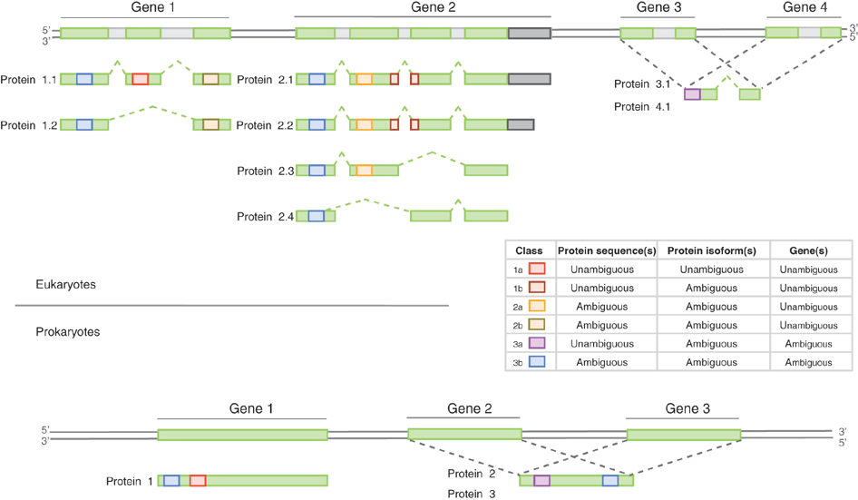

```{r style, echo = FALSE, results = 'asis', message=FALSE}
BiocStyle::markdown()
```

```{r env, echo=FALSE}
suppressPackageStartupMessages(library("ProteomicsBioc2016Workshop"))
suppressPackageStartupMessages(library("RforProteomics"))
suppressPackageStartupMessages(library("AnnotationHub"))
suppressMessages(library("BiocInstaller"))
suppressPackageStartupMessages(library("lattice"))
suppressPackageStartupMessages(library("gridExtra"))
suppressPackageStartupMessages(library("mzID"))
suppressPackageStartupMessages(library("msmsTests"))
suppressPackageStartupMessages(library("gplots"))
```

**Abstract** In this workshop, we will use R/Bioconductor packages to
explore, process, visualise and understand mass spectrometry-based
proteomics data, starting with raw data, and proceeding with
identification and quantitation data, discussing some of their
peculiarities compared to sequencing data along the way. The
participants will gain a general overview of Bioconductor packages for
mass spectrometry and proteomics, and learn how to navigate raw data
and reconstruct quantitative data. The workshop is aimed at a beginner
to intermediate level, such as, for example, seasoned R users who want
to get started with mass spectrometry and proteomics, or proteomics
practitioners who want to familiarise themselves with R and
Bioconductor infrastructure.

This short tutorial is part of the `ProteomicsBioc2016Workshop`
package (version `r packageVersion("ProteomicsBioc2016Workshop")`),
available at https://github.com/lgatto/ProteomicsBioc2016Workshop.


> This vignette available under a
> [**creative common CC-BY**](http://creativecommons.org/licenses/by/4.0/)
> license. You are free to **share** (copy and redistribute the
> material in any medium or format) and **adapt** (remix, transform,
> and build upon the material) for any purpose, even commercially.


**Modified:** `r file.info("Bioc2016.Rmd")$mtime`<br />
**Compiled**: `r date()`


# Introduction

## Installation instructions

To install this package and build the vignette

```{r install, eval=FALSE}
biocLite("lgatto/ProteomicsBioc2016Workshop",
         dependencies = TRUE, build_vignettes=TRUE)
```

To launch the vignette

```{r launch, eval=FALSE}
library("ProteomicsBioc2016Workshop")
bioc2016()
```

## MS/proteomics software available in Bioconductor

```{r pk, echo=FALSE, warning=FALSE, cache=TRUE}
biocv <- as.character(biocVersion())
pp <- proteomicsPackages(biocv)
msp <- massSpectrometryPackages(biocv)
msdp <- massSpectrometryDataPackages(biocv)
```

In Bioconductor version `r biocv`, there are respectively `r nrow(pp)`
proteomics and `r nrow(msp)` mass spectrometry software packages and
`r nrow(msdp)` mass spectrometry experiment packages. These respective
packages can be extracted with the `proteomicsPackages()`,
`massSpectrometryPackages()` and `massSpectrometryDataPackages()` and
explored interactively.


```{r pp, eval=FALSE}
library("RforProteomics")
pp <- proteomicsPackages("3.3")
display(pp)
```

## Mass spectrometry data

```{r, datatab, results='asis', echo=FALSE}

datatab <-
    data.frame(Type = c("raw", "identification", "quantitation", "peak lists", "other"),
               Format = c("mzML, mzXML, netCDF, mzData", "mzIdentML", "mzQuantML", "mgf", "mzTab"),
               Package = c(
                   "[`mzR`](http://bioconductor.org/packages/release/bioc/html/mzR.html) (read)",
                   "[`mzID`](http://bioconductor.org/packages/release/bioc/html/mzID.html) and [`mzR`](http://bioconductor.org/packages/release/bioc/html/mzR.html) (read)",
                   "",
                   "[`MSnbase`](http://bioconductor.org/packages/release/bioc/html/MSnbase.html) (read/write)",
                   "[`MSnbase`](http://bioconductor.org/packages/release/bioc/html/MSnbase.html) (read)"))
knitr::kable(datatab)
```

# Getting data

## AnnotationHub

`r Biocpkg("AnnotationHub")` is a cloud resource set up and managed by
the Bioconductor project that programmatically disseminates omics
data. I am currently working on contributing
[proteomics data](http://bioconductor.org/packages/devel/bioc/vignettes/ProteomicsAnnotationHubData/inst/doc/ProteomicsAnnotationHubData.html).

```{r ah0}
library("AnnotationHub")
ah <- AnnotationHub()
query(ah, "proteomics")
```

Below, we download a raw mass spectrometry dataset with identifier
`AH49008` and store it in a variable names `ms`.

```{r ah, message=FALSE}
ms <- ah[["AH49008"]]
ms
```

```{r mshd, echo=FALSE}
hd <- header(ms)
```

The data contains `r length(ms)` spectra - `r table(hd$msLevel)[[1]]`
MS1 spectra and `r table(hd$msLevel)[[2]]` MS2 spectra. The filename,
`r basename(fileName(ms))`, is not very descriptive because the data
originates from the `AnnotationHub` cloud repository. If the data was
read from a local file, is would be named as the `mzML` (or `mzXML`)
file. 

## ProteomeXchange

Contemporary MS-based proteomics data is disseminated through the
[ProteomeXchange](http://www.proteomexchange.org/) infrastructure,
which centrally coordinates submission, storage and dissemination
through multiple data repositories, such as the
[PRIDE](https://www.ebi.ac.uk/pride/archive/) data base at the EBI for
MS/MS experiments, [PASSEL](http://www.peptideatlas.org/passel/) at
the ISB for SRM data and the
[MassIVE](http://massive.ucsd.edu/ProteoSAFe/static/massive.jsp)
resource. The `r Biocpkg("rpx")` is an interface to ProteomeXchange
and provides a basic and unified access to PX data.

```{r, rpx}
library("rpx")
pxannounced()
```

```{r, pxd}
px <- PXDataset("PXD000001")
px
pxfiles(px)
```

Other metadata for the `px` dataset:

```{r, pxvar, eval=FALSE}
pxtax(px)
pxurl(px)
pxref(px)
```

Data files can then be downloaded with the `pxget` function as
illustrated below. 

```{r pxgetfile6, eval=TRUE}
mzf <- pxget(px, pxfiles(px)[6])
mzf
```

## Manual download

```{r}
url <- "http://proteome.sysbiol.cam.ac.uk/lgatto/files/Thermo-HELA-PRT/"
f1 <- downloadData(file.path(url, "Thermo_Hela_PRTC_1.mzML"))
f2 <- downloadData(file.path(url, "Thermo_Hela_PRTC_2.mzML"))
f1
```

# Handling raw MS data

The `mzR` package provides an interface to the
[proteowizard](http://proteowizard.sourceforge.net/) code base,
the legacy RAMP is a non-sequential parser and other C/C++ code to
access various raw data files, such as `mzML`, `mzXML`, `netCDF`, and
`mzData`. The data is accessed on-disk, i.e it does not get loaded
entirely in memory by default. The three main functions are
`openMSfile` to create a file handle to a raw data file, `header` to
extract metadata about the spectra contained in the file and `peaks`
to extract one or multiple spectra of interest. Other functions such
as `instrumentInfo`, or `runInfo` can be used to gather general
information about a run.

```{r rawms}
library("mzR")
ms <- openMSfile(mzf)
ms
```

```{r hd}
hd <- header(ms)
dim(hd)
names(hd)
```

```{r peaks}
head(peaks(ms, 234))
str(peaks(ms, 1:5))
```

#### Exercise

> Extract the index of the MS2 spectrum with the highest base peak
> intensity and plot its spectrum (using the `plot` method - we will
> see more about MS data visualisation in the next section). Is the
> data centroided or in profile mode?

```{r, ex_raw, echo=FALSE, eval=FALSE, fig.align='center'}
hd2 <- hd[hd$msLevel == 2, ]
i <- which.max(hd2$basePeakIntensity)
hd2[i, ]
pi <- peaks(ms, hd2[i, 1])
plot(pi, type = "h")
mz <- hd2[i, "basePeakMZ"]
plot(pi, type = "h", xlim = c(mz-0.5, mz+0.5))

pj <- peaks(ms, 100)
plot(pj, type = "l")
plot(pj, type = "l", xlim = c(536,540))
```

# Handling identification data

The `ProteomicsBioc2016Workshop` package distributes a small
identification result file (see
`?TMT_Erwinia_1uLSike_Top10HCD_isol2_45stepped_60min_01.mzid`) that we
load and parse using infrastructure from the `r Biocpkg("mzID")`
package.

```{r id, cache=TRUE}
library("mzID")
(f <- dir(system.file("extdata", package = "ProteomicsBioc2016Workshop"),
         pattern = "mzid", full.names = TRUE))
id <- mzID(f)
software(id)
id
```

Various data can be extracted from the `mzID` object, using one the
accessor functions such as `database`, `sofware`, `scans`, `peptides`,
... The object can also be converted into a `data.frame` using the
`flatten` function.

```{r fid}
head(flatten(id))
```

The `mzR` interface provides a similar interface. It is however much
faster as it does not read all the data into memory and only extracts
relevant data on demand. It has also accessor functions such as
`softwareInfo`, `mzidInfo`, ... (use `showMethods(classes = "mzRident", where = "package:mzR")`)
to see all available methods.

```{r id2}
library("mzR")
id2 <- openIDfile(f)
id2
softwareInfo(id2)
```

The identification data can be accessed as a `data.frame` with the
`psms` accessor.

```{r fid2}
head(psms(id2))
```

#### Exercise

> Is there a relation between the length of a protein and the number
> of identified peptides, conditioned by the (average) e-value of the
> identifications?

```{r, ex_id, echo = FALSE, eval=FALSE}
fid <- flatten(id)
x <- by(fid, fid$accession, function(x)
    c(unique(x$length),
      length(unique(x$pepseq)),
      mean(x$'ms-gf:specevalue')))
x <- data.frame(do.call(rbind, x))
colnames(x) <- c("plength", "npep", "eval")
x$bins <- cut(x$eval, summary(x$eval))
library("lattice")
xyplot(plength ~ npep | bins, data = x)
```

# MS/MS database search

While searches are generally performed using third-party software
independently of R or can be started from R using a `system` call, the
`r Biocpkg("rTANDEM")` package allows one to execute such searches
using the X!Tandem engine. 

```{r rtandem, eval=FALSE}
library("rTANDEM")
?rtandem
```

The `r Biocpkg("MSGPplus")` package provides an interface to the very
fast `MSGF+` engine.

```{r msgfplus, eval = FALSE}
library("MSGFplus")
parameters <- msgfPar(database = 'milk-proteins.fasta',
                      tolerance = '20 ppm',
                      instrument = 'TOF')
runMSGF(parameters, 'msraw.mzML')
```

# High-level data interface

The above sections introduced low-level interfaces to raw and
identification results. The `r Biocpkg("MSnbase")` package provides
abstractions for raw data through the `MSnExp` class and containers
for quantification data via the `MSnSet` class. Both store the actual
assay data (spectra or quantitation matrix) and sample and feature
metadata, accessed with `spectra` (or the
`[`, `[[` operators) or `exprs`, `pData` and `fData`.

The figure below give a schematics of an `MSnSet` instance and the
relation between the assay data and the respective feature and sample
metadata.


```{r, msnset, echo=FALSE, fig.width = 5, fig.height = 7, fig.align='center'}
plot(NA, xlim = c(0, 5), ylim = c(0, 10), axes=FALSE, xlab = NA, ylab = NA)
rect(0, 0, 3, 1.9)
rect(0, 2, 3, 10)
rect(3.05, 2, 5, 10)

segments(seq(0, 3, length.out = 7),
         rep(0, 7),
         seq(0, 3, length.out = 7),
         rep(10, 7),
         lty = "dotted")

segments(rep(0, 50),
         seq(2, 10, length.out = 50),
         rep(5, 100),
         seq(2, 10, length.out = 50),
         lty = "dotted")

text(1.5, 1, "sample metadata", cex = 1.5)
text(1.5, 6, "assay data", cex = 1.5)
text(4, 6, "feature\nmetadata", cex = 1.5)
```

Another useful slot is `processingData`, accessed with
`processingData(.)`, that records all the processing that objects have
undergone since their creation (see examples below).

The `readMSData` will parse the raw data, extract the MS2 spectra and
construct an MS experiment file.

```{r msnbase}
library("MSnbase")
quantFile <- dir(system.file(package = "MSnbase", dir = "extdata"),
                 full.name = TRUE, pattern = "mzXML$")
quantFile
msexp <- readMSData(quantFile, verbose=FALSE)
msexp
```

The identification results stemming from the same raw data file can
then be used to add PSM matches.

```{r addid}
## find path to a mzIdentML file
identFile <- dir(system.file(package = "MSnbase", dir = "extdata"),
                 full.name = TRUE, pattern = "mzid$")
identFile
msexp <- addIdentificationData(msexp, identFile)
fData(msexp)
```

```{r specplot}
msexp[[1]]
as(msexp[[1]], "data.frame")[100:105, ]
```

`MSnExp` object load all MS data into memory. This is a viable
solution for MS2 data, but does not scale to MS1 data, especially when
multiple files are loaded together. With the help of
[Johannes Rainer](http://github.com/jotsetung), a new `MSnExp` class
supporting on disk access is being developed.

# Visualising raw data

## A full chromatogram

```{r chromato}
chromatogram(ms)
```

## Multiple chromatograms

```{r chromato3, cache=TRUE}
c1 <- chromatogram(f1)
c2 <- chromatogram(f2, plot = FALSE)
lines(c2, col = "steelblue", lty = "dashed")
```

## An extracted ion chromatogram

```{r xic, cache=TRUE, fig.width=12}
par(mfrow = c(1, 2))
xic(ms, mz = 636.925, width = 0.01)
x <- xic(ms, mz = 636.925, width = 0.01, rtlim = c(2120, 2200))
```

## Spectra

We first load a test iTRAQ data called `itraqdata` and distributed as
part of the `r Biocpkg("MSnbase")` package using the `data`
function. This is a pre-packaged data that comes as a dedicated data
structure called `MSnExp`. We then `plot` the 10th spectrum using
specific code that recognises what to do with an element of an
`MSnExp`.

```{r itraqdata}
data(itraqdata)
itraqdata
plot(itraqdata[[10]], reporters = iTRAQ4, full=TRUE) 
```

The `ms` data is not pre-packaged as an `MSnExp` data. It is a more
bare-bone `r as.character(class(ms))` object, a pointer to a raw data
file (here `r basename(fileName(ms))`): we need first to extract a
spectrum of interest (here the 3071st spectrum, an MS1 spectrum), and
use the generic `plot` function to visualise the spectrum.

```{r ms1}
plot(peaks(ms, 3071), type = "h",
     xlab = "M/Z", ylab = "Intensity",     
     sub = formatRt(hd[3071, "retentionTime"]))
```

The importance of flexible access to specialised data becomes visible
in the figure below (taken from the `r Biocannopkg("RforProteomics")`
[visualisation vignette](http://bioconductor.org/packages/release/data/experiment/vignettes/RforProteomics/inst/doc/RProtVis.html)).
**Not only can we access specific data and understand/visualise them,
but we can transverse all the data and extracted/visualise/understand
structured slices of data.**


In this code chunks we start by selecting relevant spectra of
interest. We will focus on the first MS1 spectrum acquired after 30
minutes of retention time.


```{r pxd1}
## (1) Open raw data file
ms <- openMSfile(mzf)
## (2) Extract the header information
hd <- header(ms)
## (3) MS1 spectra indices
ms1 <- which(hd$msLevel == 1)
## (4) Select MS1 spectra with retention time between 30 and 35 minutes
rtsel <- hd$retentionTime[ms1] / 60 > 30 & hd$retentionTime[ms1] / 60 < 35
## (5) Indices of the 1st and 2nd MS1 spectra after 30 minutes
i <- ms1[which(rtsel)][1]
j <- ms1[which(rtsel)][2]
## (6) Interleaved MS2 spectra
ms2 <- (i+1):(j-1)
```

Now now extract and plot all relevant information:

1. The upper panel represents the chromatogram of the `r fileName(ms)`
   raw data file, produced with `chromatogram`.

```{r visfig01}
chromatogram(ms)
```

2. We concentrate at a specific retention time, 
   `r formatRt(hd[i, "retentionTime"])` minutes (`r hd[i, "retentionTime"]` seconds) 

```{r visfig02}
chromatogram(ms)
abline(v = hd[i, "retentionTime"], col = "red")
```

3. This corresponds to the `r i`th MS1 spectrum, shown on the second
   row of figures.

```{r visfig03}
plot(peaks(ms, i), type = "l", xlim = c(400, 1000))
legend("topright", bty = "n",
       legend = paste0(
           "Acquisition ", hd[i, "acquisitionNum"],  "\n",
           "Retention time ", formatRt(hd[i, "retentionTime"])))
```

4. The ions that were selected for MS2 are highlighted by vertical
   lines. These are represented in the bottom part of the figure.

```{r visfig04}
plot(peaks(ms, i), type = "l", xlim = c(400, 1000))
legend("topright", bty = "n",
       legend = paste0(
           "Acquisition ", hd[i, "acquisitionNum"],  "\n",
           "Retention time ", formatRt(hd[i, "retentionTime"])))
abline(v = hd[ms2, "precursorMZ"],
       col = c("#FF000080",
           rep("#12121280", 9)))
```

5. On the right, we zoom on the isotopic envelope of one peptide in
   particular (the one highlighted with a red line).

```{r visfig05}
plot(peaks(ms, i), type = "l", xlim = c(521, 522.5))
abline(v = hd[ms2, "precursorMZ"], col = "#FF000080")
```

6. A final loop through the relevant MS2 spectra plots the
   `length(ms2)` MS2 spectra highlighted above.

```{r visfig06, fig.width = 8, fig.height = 10}
par(mfrow = c(5, 2), mar = c(2, 2, 0, 1))
for (ii in ms2) {
    p <- peaks(ms, ii)
    plot(p, xlab = "", ylab = "", type = "h", cex.axis = .6)
    legend("topright", legend = paste0("Prec M/Z\n",
                           round(hd[ii, "precursorMZ"], 2)),
           bty = "n", cex = .8)
}
```

```{r mslayout, echo=FALSE}
## Preparing the layout (not shown)
lout <- matrix(NA, ncol = 10, nrow = 8)
lout[1:2, ] <- 1
for (ii in 3:4)
    lout[ii, ] <- c(2, 2, 2, 2, 2, 2, 3, 3, 3, 3)
lout[5, ] <- rep(4:8, each = 2)
lout[6, ] <- rep(4:8, each = 2)
lout[7, ] <- rep(9:13, each = 2)
lout[8, ] <- rep(9:13, each = 2)
```

Putting it all together:

```{r visfig}
layout(lout)
par(mar=c(4,2,1,1))
chromatogram(ms)

abline(v = hd[i, "retentionTime"], col = "red")
par(mar = c(3, 2, 1, 0))
plot(peaks(ms, i), type = "l", xlim = c(400, 1000))
legend("topright", bty = "n",
       legend = paste0(
           "Acquisition ", hd[i, "acquisitionNum"],  "\n",
           "Retention time ", formatRt(hd[i, "retentionTime"])))
abline(h = 0)
abline(v = hd[ms2, "precursorMZ"],
       col = c("#FF000080",
           rep("#12121280", 9)))

par(mar = c(3, 0.5, 1, 1))
plot(peaks(ms, i), type = "l", xlim = c(521, 522.5),
     yaxt = "n")
abline(h = 0)
abline(v = hd[ms2, "precursorMZ"], col = "#FF000080")

par(mar = c(2, 2, 0, 1))
for (ii in ms2) {
    p <- peaks(ms, ii)
    plot(p, xlab = "", ylab = "", type = "h", cex.axis = .6)
    legend("topright", legend = paste0("Prec M/Z\n",
                           round(hd[ii, "precursorMZ"], 2)),
           bty = "n", cex = .8)
}
```

Below, we illustrate some additional visualisation and animations of
raw MS data, also taken from the `r Biocannopkg("RforProteomics")`
[visualisation vignette](http://bioconductor.org/packages/release/data/experiment/vignettes/RforProteomics/inst/doc/RProtVis.html). On
the left, we have a heatmap visualisation of a MS map and a 3
dimensional representation of the same data. On the right, 2 MS1
spectra in blue and the set of interleaves 10 MS2 spectra.

```{r msmap1, message=FALSE, fig.width=15, echo=TRUE}
## (1) MS space heaptmap
M <- MSmap(ms, ms1[rtsel], 521, 523, .005, hd)
ff <- colorRampPalette(c("yellow", "steelblue"))
trellis.par.set(regions=list(col=ff(100)))
m1 <- plot(M, aspect = 1, allTicks = FALSE)
## (2) Same data as (1), in 3 dimenstion
M@map[msMap(M) == 0] <- NA
m2 <- plot3D(M, rgl = FALSE)
## (3) The 2 MS1 and 10 interleaved MS2 spectra from above
i <- ms1[which(rtsel)][1]
j <- ms1[which(rtsel)][2]
M2 <- MSmap(ms, i:j, 100, 1000, 1, hd)
m3 <- plot3D(M2)
grid.arrange(m1, m2, m3, ncol = 3)
```

Below, we have animations build from extracting successive slices as above.

```{r two-col-1, results='asis', echo=FALSE, out.extra=''}
cat("<table class='container'><tr>")
cat("<td>")
```

```{r two-col-2, results='asis', echo=FALSE, out.extra=''}
cat("</td>")
cat("<td>")
```
 
```{r two-col-3, results='asis', echo=FALSE, out.extra=''}
cat("</td>")
cat("</tr></table>")
```


# Identification data

Annotated spectra and comparing spectra. 

```{r id1, message=FALSE, fig.width=15, message=FALSE}
par(mfrow = c(1, 2))
itraqdata2 <- pickPeaks(itraqdata, verbose = FALSE)
s <- "SIGFEGDSIGR"
plot(itraqdata2[[14]], s, main = s)
plot(itraqdata2[[25]], itraqdata2[[28]], sequences = rep("IMIDLDGTENK", 2))
```

The annotation of spectra is obtained by simulating fragmentation of a
peptide and matching observed peaks to fragments:

```{r fag}
calculateFragments("SIGFEGDSIGR")
```

Visualising a pair of spectra means that we can access them, and that,
in addition to plotting, we can manipulate them and perform
computations. The two spectra corresponding to the `IMIDLDGTENK`
peptide, for example have 
`r compareSpectra(itraqdata2[[25]], itraqdata2[[28]], fun = "common")` 
common peaks, a correlation of 
`r round(compareSpectra(itraqdata2[[25]], itraqdata2[[28]], fun = "cor"), 3)` 
and a dot product of 
`r round(compareSpectra(itraqdata2[[25]], itraqdata2[[28]], fun = "dotproduct"), 3)` 
(see `?compareSpectra` for details).

There are 2 Bioconductor packages for peptide-spectrum matching
directly in R, namely `r Biocpkg("MSGFplus")` and `r Biocpkg("rTANDEM")`,
replying on `MSGF+` and `X!TANDEM` respectively. 
See also the `r Biocpkg("MSGFgui")` package for visualisation of
identification data.


# Quantitative proteomics data

There are a wide range of proteomics quantitation techniques that can
broadly be classified as labelled vs. label-free, depending whether
the features are labelled prior the MS acquisition and the MS level at
which quantitation is inferred, namely MS1 or MS2. 

```{r, quanttab, echo=FALSE, results='asis'}
qtb <- matrix(c("XIC", "Counting", "SILAC, 15N", "iTRAQ, TMT"),
              nrow = 2, ncol = 2)
dimnames(qtb) <- list(
    'MS level' = c("MS1", "MS2"),
    'Quantitation' = c("Label-free", "Labelled"))
knitr::kable(qtb)
```

* Isobaric tagging (iTRAQ and TMT): `r Biocpkg("MSnbase")` and `r Biocpkg("isboar")`.
* Label-free: `r Biocpkg("xcms")` (metabolomics).
* Counting: `r Biocpkg("MSnbase")` and `r Biocpkg("MSnID")` for
  peptide-spectrum matching confidence assessment.
* `r Githubpkg("vladpetyuk/N14N15")` for heavy Nitrogen-labelled data.

## From raw data to quantitative data

In terms of raw data quantitation, most efforts have been devoted to
MS2-level quantitation. Label-free XIC quantitation has however been
addressed in the frame of metabolomics data processing by the
[`xcms`](http://bioconductor.org/packages/release/bioc/html/xcms.html)
infrastructure. 

### Isobaric tagging

An `MSnExp` is converted to an `MSnSet` by the `quantitation`
method. Below, we use the iTRAQ 4-plex isobaric tagging strategy
(defined by the `iTRAQ4` parameter; other isobaric tags are available).

```{r, itraq4plot, fig.align='center'}
plot(msexp[[1]], full=TRUE, reporters = iTRAQ4)
```

```{r, quantitraq}
msset <- quantify(msexp, method = "trap", reporters = iTRAQ4, verbose = FALSE)
exprs(msset)
processingData(msset)
```

**See also** The `r Biocpkg("isobar")` package supports quantitation
from centroided `mgf` peak lists or its own tab-separated files that
can be generated from Mascot and Phenyx vendor files.

### Label-free MS2

Other MS2 quantitation methods available in `quantify` include the
(normalised) spectral index `SI` and (normalised) spectral abundance
factor `SAF` or simply a simple count method.

```{r, lfms2}
exprs(si <- quantify(msexp, method = "SIn"))
exprs(saf <- quantify(msexp, method = "NSAF"))
```

Note that spectra that have not been assigned any peptide (`NA`) or
that match non-unique peptides (`npsm > 1`) are discarded in the
counting process.

### Spectral counting

The `r Biocpkg("MSnID")` package provides enables to explore and
assess the confidence of identification data using `mzid` files. A
subset of all peptide-spectrum matches, that pass a specific false
discovery rate threshold can them be converted to an `MSnSet`, where
the number of peptide occurrences are used to populate the assay data.

## Importing third-party data

The PSI `mzTab` file format is aimed at providing a simpler (than XML
formats) and more accessible file format to the wider community. It is
composed of a key-value metadata section and peptide/protein/small
molecule tabular sections. 

```{r, mztab}
mztf <- pxget(px, pxfiles(px)[2])
(mzt <- readMzTabData(mztf, what = "PEP", version = "0.9"))
```

It is also possible to import arbitrary spreadsheets as `MSnSet`
objects into R with the `readMSnSet2` function. The main 2 arguments
of the function are (1) a text-based spreadsheet or a `data.frame` and
(2) column names of indices that identify the quantitation data.

```{r, readmsnset2}
csv <- dir(system.file ("extdata" , package = "pRolocdata"),
           full.names = TRUE, pattern = "pr800866n_si_004-rep1.csv")
getEcols(csv, split = ",")
ecols <- 7:10
res <- readMSnSet2(csv, ecols)
head(exprs(res))
head(fData(res))
```

# Quantitative data processing and analysis

## Processing

Processing quantitative proteomics data is very similar to processing
transcriptomics data. When working with `MSnSet` instances, a set of
methods for data processing and visualisation are readily available to
streamline and track the process:

- `purityCorrect` to correct for isobaric tag impurities
- `normalise` (or `normalize`) to, well, normalise data using
  quantile, vsn, mean, ... normalisation
- `filterNA` to remove feature with (a certain proportion) of missing
  values
- `impute` to impute missing values using a wide range of methods
  (more on this below)
- `image`, `MAplot`, `plot2D` (for dimensionality reduction using PCA,
  t-SNE, MDS, ...), ... to visualise data
- ...

## Differentially expression

* Isobaric tagging (iTRAQ and TMT): `r Biocpkg("isboar")`
* Label-free: `r CRANpkg("aLFQ")` and `r CRANpkg("protiq")`
* `r Biocpkg("msmsTests")` for the RNA-seq count-based models and
  tests

```{r msmstest}
library("msmsTests")
data(msms.dataset) ## an MSnSet
e <- pp.msms.data(msms.dataset)
head(exprs(e))
```

```{r msmstest2}
pData(e)
null.f <- "y~batch"
alt.f <- "y~treat+batch"
div <- apply(exprs(e),2,sum)
res <- msms.edgeR(e,alt.f,null.f,div=div,fnm="treat")     
head(res)
```
  
* `r Biocpkg("MSstats")` for various statistical analyses
* and of course `r Biocpkg("limma")`
* ...

## Machine learning

* `MSnSet` support `r Biocpkg("MLInterfaces")` out-of-the-box.
* While tailor for spatial proteomics data, `r Biocpkg("pRoloc")`'s
  machine learning methods are useful in a wide range of cases and
  work with `MSnSet` instances.


# Some differences with RNASeq and transcriptomics in general

## Missing values


```{r na}
data(naset)
naplot(naset, col = "black")
```

### Filtering

One solution is to remove all or part of the features that have
missing values (see `?filterNA`).

```{r filterNA}
flt <- filterNA(naset)
processingData(flt)
```

### Identification transfer

Identification transfer between acquisitions (label-free): if a feature
was not acquired in MS2 in one replicate, it is possible to find the
ion in MS space based on the M/Z and retention time coordinates of the
same ion in a replicate where it was identified. (An example of this
is implemented in the `r Biocpkg("synapter")` package).

### Imputation

It is of course possible to impute missing values (`?impute`). This is
however not a straightforward thing, as is likely to dramatically fail
when a high proportion of data is missing (10s of %). But also, there
are two types of mechanisms resulting in missing values in LC/MSMS
experiments.

* Missing values resulting from absence of detection of a feature,
  despite ions being present at detectable concentrations.  For
  example in the case of ion suppression or as a result from the
  stochastic, data-dependent nature of the MS acquisition
  method. These missing value are expected to be randomly distributed
  in the data and are defined as **missing at random** (MAR) or
  **missing completely at random** (MCAR).

* Biologically relevant missing values, resulting from the *absence*
  or the low abundance of ions (below the limit of detection of the
  instrument). These missing values are not expected to be randomly
  distributed in the data and are defined as **missing not at random**
  (MNAR).
  
```{r naheatmap, echo=FALSE}
x <- impute(naset, "zero")
exprs(x)[exprs(x) != 0] <- 1
library("gplots")
heatmap.2(exprs(x), col = c("lightgray", "black"),
          scale = "none", dendrogram = "none",
          trace = "none", keysize = 0.5, key = FALSE,
          RowSideColors = ifelse(fData(x)$randna, "orange", "brown"),
          ColSideColors = rep(c("steelblue", "darkolivegreen"), each = 8))
```

Different imputation methods are more appropriate to different classes
of missing values (as documented in this
[paper](http://pubs.acs.org/doi/abs/10.1021/acs.jproteome.5b00981)). Values
missing at random, and those missing not at random should be imputed
with different methods.


It is recommended to use **hot deck** methods (nearest neighbour
(**left**), maximum likelihood, ...) when data are missing at
random.Conversely, MNAR features should ideally be imputed with a
**left-censor** (minimum value (**right**), but not zero, ...) method.

## Coverage

- Coverage in proteomics in `%`
- [Coverage](http://www.ncbi.nlm.nih.gov/pubmed/24434847) in RNA-Seq in fold `X`

The following values are higher bounds, *without* peptide filtering for
about 80000 *gene groups* 


```{r}
data(cvg)
hist(cvg$coverage, breaks = 100, xlab = "coverage", main = "")
```

And

- the majority of peptides map to a minority of proteins different

- peptides within one protein can be differently detectable in MS
  acquisitions


## Protein inference and protein groups



From [Qeli and Ahrens (2010)](http://www.ncbi.nlm.nih.gov/pubmed/20622826).
See also [Nesvizhskii and Aebersold (2005)](http://www.ncbi.nlm.nih.gov/pubmed/16009968).

Often, in proteomics experiments, the features represent single
proteins and **groups** of indistinguishable or non-differentiable
proteins identified by shared (non-unique) peptides.

## Identifier mapping

The latest UniProt 

```{r up}
data(upens)
data(upenst)
```

Where `upens` and `upenst` where created by querying the Ensembl gene
and transcript identifiers for all human UniProtKB accession numbers
against the UniProt web services. (See `?upens` for details.)


```{r idmappingplot, echo=FALSE}
par(mfrow = c(2, 1))
barplot(table(tapply(upens[, 2], upens[, 1], function(x) length(na.omit(x)))),
        main = "Ensembl genes - UnitProtKB mapping")
barplot(table(tapply(upenst[, 2], upenst[, 1], function(x) length(na.omit(x)))),
        main = "Ensembl transcripts - UnitProtKB mapping")
```

# Annotation

All the
[Bioconductor annotation infrastructure](http://bioconductor.org/help/workflows/annotation/annotation/),
such as `r Biocpkg("biomaRt")`, `r Biocpkg("GO.db")`, organism
specific annotations, .. are directly relevant to the analysis of
proteomics data. Some proteomics-centred annotations such as the PSI
Mass Spectrometry Ontology, Molecular Interaction (PSI MI 2.5) or
Protein Modifications are available through the `r Biocpkg("rols")`. 
Data from the
[Human Protein Atlas](http://www.proteinatlas.org/) 
(`r Biocpkg("hpar")`) and UniProt (`r Biocpkg("UniProt.ws")`) are also
available.


# More information

## References and resources

* [Visualisation of proteomics data using R and Bioconductor](http://www.ncbi.nlm.nih.gov/pmc/articles/PMC4510819/)
* [Using R and Bioconductor for proteomics data analysis](http://arxiv.org/pdf/1305.6559v1.pdf)
* `RforProteomics`: http://bioconductor.org/packages/RforProteomics
* [R/Bioconductor workflow](http://bioconductor.org/help/workflows/proteomics/)

## Other relevant packages/pipelines

- Analysis of post translational modification with `r Biocpkg("isboar")`.
- Processing and analysis or isobaric tagging mass spectrometry with
  `r Biocpkg("isobar")` and `r Biocpkg("MSnbase")`.
- Analysis of spatial proteomics data with `r Biocpkg("pRoloc")`.
- Analysis of MALDI data with the `r Biocpkg("MALDIquant")` package.
- Access to the Proteomics Standard Initiative Common QUery InterfaCe
  with the `r Biocpkg("PSICQUIC")` package.
- `r Biocpkg("Cardinal")`: A mass spectrometry imaging toolbox for
  statistical analysis.
- `r Biocpkg("MSnID")`: Utilities for Exploration and Assessment of
  Confidence of LC-MSn Proteomics Identifications.
- `r CRANpkg("protViz") `: Visualising and Analysing Mass Spectrometry
  Related Data in Proteomics
- `r CRANpkg("aLFQ")`: Estimating Absolute Protein Quantities from
  Label-Free LC-MS/MS Proteomics Data.
- `r CRANpkg("protiq")`: Protein (identification and) quantification
  based on peptide evidence.  
- `r Biocpkg("MSstats")`: Protein Significance Analysis in DDA, SRM
  and DIA for Label-free or Label-based Proteomics Experiments


### DIA

- Analysis of label-free data from a Synapt G2 (including ion
  mobility) with `r Biocpkg("synapter")`.
- `r Biocpkg("SWATH2stats")`: Transform and Filter SWATH Data for
  Statistical Packages and
- `r Biocpkg("specL")`: Prepare Peptide Spectrum Matches for Use in
  Targeted Proteomics
- `r Biocpkg("SwathXtend")`: SWATH extended library generation and
  statistical data analysis


# Session information

The source used to generate this document is available
[here](https://github.com/lgatto/ProteomicsBioc2016Workshop/blob/master/vignettes/Bioc2016.Rmd).

```{r, si, echo=FALSE}
print(sessionInfo(), local = FALSE)
```
